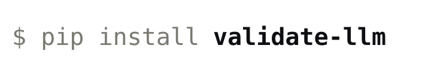

<picture>
  <source media="(prefers-color-scheme: dark)" srcset="brand/pip-install-dark.svg">
  
</picture>

<br>

Composable validation guardrails for LLM pipelines — accuracy, relevancy, toxicity, privacy, and bias checks in one pipeline.

**[Documentation →](https://tyeoh9.github.io/llm-validation-framework)**

---

## Install

```bash
pip install validate-llm
```

Requires Python 3.11+. Optional extras:

```bash
pip install "validate-llm[demo]"   # FastAPI demo server + web UI
pip install "validate-llm[test]"   # pytest + datasets
pip install "validate-llm[dev]"    # everything
```

## Quick start

```python
from llm_validation_framework import ValidationFramework, LLMProvider, Pipe
from llm_validation_framework import ToxicityAgent, PrivacyAgent, AccuracyAgent
from llm_validation_framework.config_loader import load_api_key

llm = LLMProvider(provider="anthropic", model="claude-haiku-4-5-20251001", key=load_api_key())

vf = ValidationFramework(
    llm=llm,
    input_guardrail=Pipe(steps=[ToxicityAgent()], verbose=False),
    output_guardrail=Pipe(steps=[ToxicityAgent(), PrivacyAgent(), AccuracyAgent()], verbose=False),
)

result = vf.validate("What is the Pacific Ocean?")
print(result["status"], result["score"])  # PASS 0.87
```

`validate()` returns a structured dict with `status`, `score`, and per-agent `results` for both the input and output guardrails. See the [docs](https://tyeoh9.github.io/llm-validation-framework/core/validation-framework/) for the full schema.

## Agents

| Agent | What it does | Needs API key |
|---|---|---|
| `ToxicityAgent` | Three-layer check: profanity filter → toxicity model → semantic similarity | No |
| `PrivacyAgent` | Regex scan for SSN, credit cards, API keys; optional system prompt leakage detection | No |
| `AccuracyAgent` | LLM-as-a-judge factual accuracy + relevancy, with optional RAG grounding | Yes |
| `RelevancyAgent` | LLM-as-a-judge check that the answer addresses the question | Yes |
| `BiasAgent` | LLM-as-a-judge scan for stereotypes and discriminatory language | Yes |

`ToxicityAgent` and `PrivacyAgent` run fully locally with no external calls.

## Config

```bash
export ANTHROPIC_API_KEY=your-key
```

Or create a `config.ini` at the repo root (gitignored):

```ini
[ANTHROPIC]
API_KEY=your-key
```

Supported providers follow [litellm's naming](https://docs.litellm.ai/docs/providers).

## RAG grounding

Pass a retriever to `AccuracyAgent` to ground factual checks against your own corpus:

```python
from llm_validation_framework import AccuracyAgent, RAGProvider

accuracy = AccuracyAgent(rag=RAGProvider(your_vectorstore.as_retriever()))
```

See the [RAG Integration guide](https://tyeoh9.github.io/llm-validation-framework/guides/rag-integration/) for a full walkthrough.

## Demo

The demo is a FastAPI backend + static web UI.

```bash
# Terminal 1
uvicorn demo.api_server:app --host 127.0.0.1 --port 5050

# Terminal 2
python demo/serve_ui.py
```

Open `http://127.0.0.1:8000`.

## Contributors

- Hitha Shri Nagaruru
- James Wu
- Lewis Lui
- Thomas Yeoh

## License

MIT — see [LICENSE](LICENSE)
